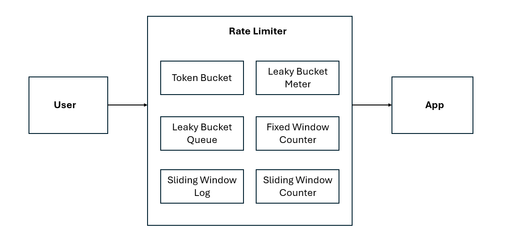

<<<<<<< HEAD
# Rate limiter
A Rate limiter is a feature/application that measures the requests and events and limits the access to the system. The tracking and measurement is based on different algorithms.Depending on the algorithm, we could delay or reject such usages.we will see some of the common implementations in this repository. 
### Purpose
A Rate limiter is mainly used to prevent excessive usage by an user, cyber attacks, and maintain a stable traffic into the system. 
### Flow Diagram

