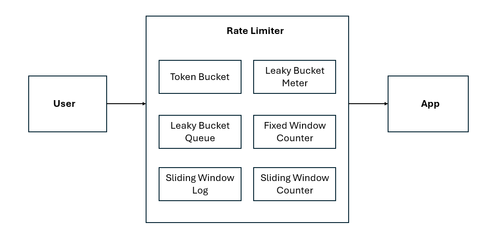
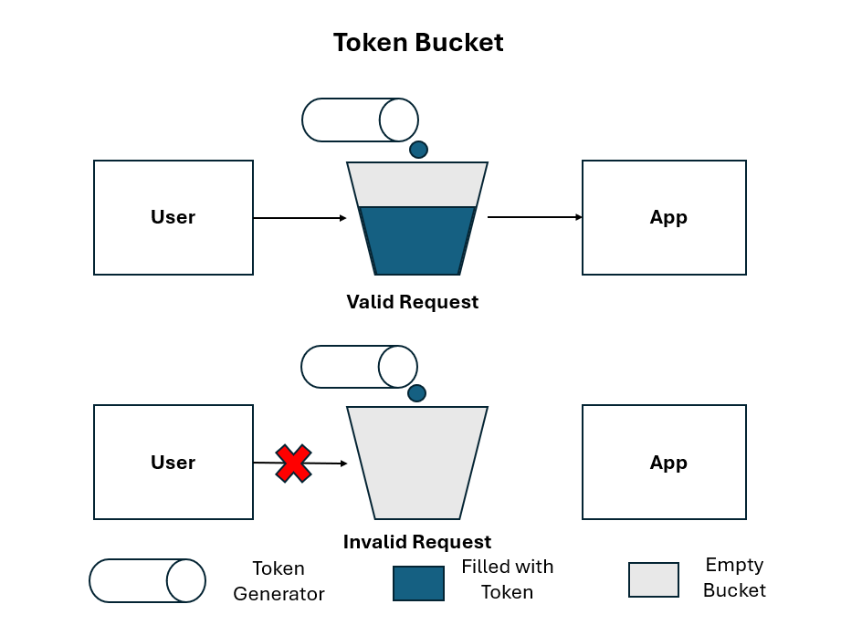
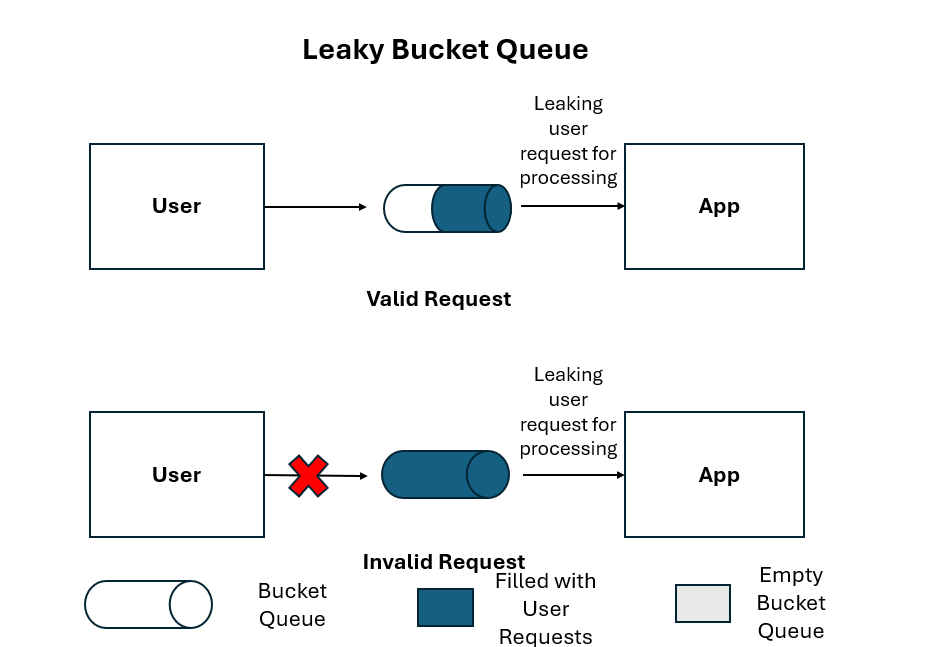
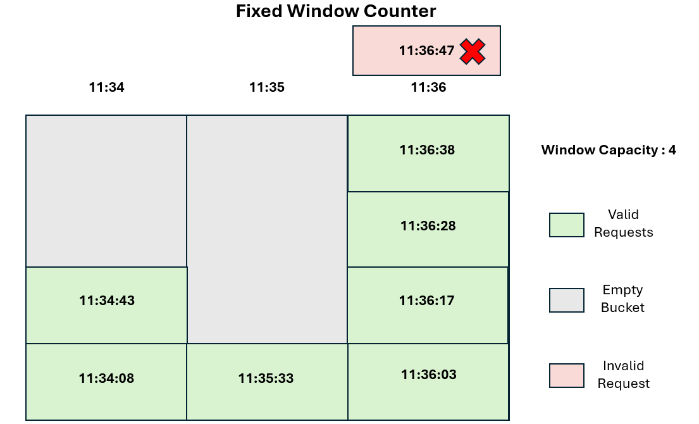
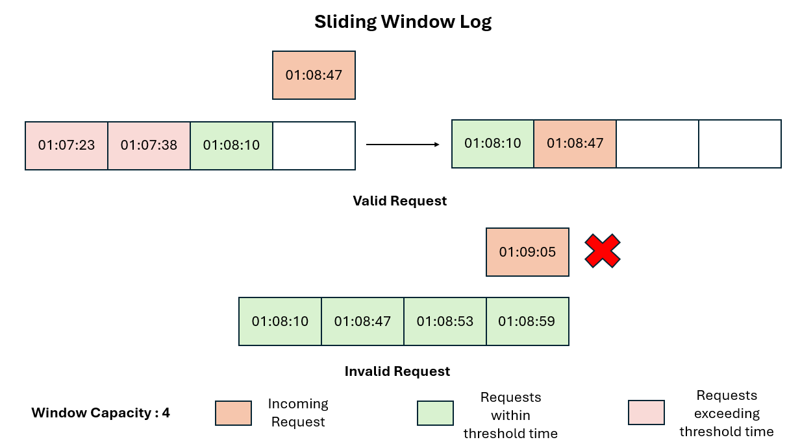

# Rate limiter
A Rate limiter is a feature/application that measures the requests and events and limits the access to the system. The tracking and measurement is based on different algorithms.Depending on the algorithm, we could delay or reject such usages.we will see some of the common implementations in this repository. 
### Purpose
A Rate limiter is mainly used to prevent excessive usage by a user, and cyber attacks, and maintain stable traffic into the system.
### Flow Diagram

A basic architecture of the Rate Limiter flow with the common algorithms

## Coding Challenge By John Crickett
This was implemented as a solution to one of the coding challenges by John Crickett [CodingChallengesByJohnCrickett] https://codingchallenges.substack.com/p/coding-challenge-27-rate-limiter
Please let me know if you find suggestions and improvement in the implementation via Linkedin [MyLinkedInProfile] https://www.linkedin.com/in/prince-patrick-anand-victor/ as it would help me improve in my future projects.

## Local Software Configuration
Oracle OpenJDK 22.0.1

## Major Spring boot dependencies actively used:
Spring boot starter web: It is used to handle all the web based service requests and basic web integration
Spring boot starter data redis: It is used to integrate and manager the redis key-value store from the spring boot application
Spring boot auto configure: This is used for auto configuring the spring boot app based on the provided dependencies

Other unused dependencies Spring boot starter test, Lombok etc., would be used for future tasks in the project and this section would be updated respectively.

## Steps to run the application
- Clone this repository
- In the application.properties, change the filter.type into [ tokenBucket, leakyBucketQueue, leakyBucketMeter, fixedWindowCounter, slidingWindowLog, slidingWindowCounter ]
- Change the class names in the FilterConfig to suit the implementation you want to run.
- If you are using one of the Token Bucket, Leaky Bucket Meter and Leaky Bucket Queue, please uncomment the scheduled/cron jobs in respective implementation in the com.example.ratelimiter.algorithm

# Rate Limiting Algorithms:
## Token Bucket:
The token bucket algorithm uses a bucket that stores tokens, and each token is a ticket or pass that allows a service request to flow through. We use a token generator, that generates tokens at a fixed rate. As long as a token is available in the bucket, the user request can be processed.

The Token Generator generates tokens and puts them into the bucket. When there is a token present in the bucket, the request is handled or processed. When the bucket is empty, then the user request is limited.
### Notes:
- Due to the fixed size of the data structure, it is well suited in memory constraint use cases.
- Can handle small bursts of traffic
- Simple algorithm but can be difficult in handling complex scenarios such as distributed calls

## Leaky Bucket Queue:
The Leaky Bucket Queue is the inverse of the token bucket, where we use the bucket to hold the incoming service requests. Then, at a fixed interval, we process (leak) a request from the bucket. When the bucket is already full with the existing requests, then the upcoming requests are limited.

The bucket stores the user requests indicated by the blue colored part. As long there is a space for additional request for the bucket, the user requests are accepted. 
### Notes:
- Is suited in memory constraint scenarios due to the limited memory.
- Can handle small burst of traffics.
- Could be harder to manage in complex scenarios.

## Leaky Bucket Meter:
The Leaky Bucket Meter is the re-implementation of the leaky bucket queue, without the "queue" instead we use a counter to "meter" the number of available requests that could be handled.
### Notes:
- Shares all the pros and cons of Leaky Bucket Queue, but minimizes the memory requirements as it eliminates the need of the data structure.

## Fixed Window Counter:
The fixed window counter uses a time-based window with a specific limit, to measure the usage. If the number of requests exceeds the fixed limit for the time window, then the requests are limited.

We have defined the window based on the minute at which the service enters the rate-limiting process and we have a window capacity of 4. Hence, when the number of requests meets the limit (as in 11:34 and 11:35) the requests are processed, whereas when the number of requests exceeds (as in 11:36) then the request is restricted.
### Notes:
- Good at handling memory constraints.
- Faces difficulty in a high number of requests at the edges between time windows.

## Sliding Window Log:
The sliding window log uses timestamp-based logs and threshold time to rate limit. The eligible requests in the window should be within the threshold time in the past of the incoming request. If the existing requests are beyond the given threshold, then those requests are removed from the queue/window. If the number of requests within the current sliding time window has met the limit, then the incoming requests are rejected.

The threshold time for the sliding window log is 1 minute and the number of permissible requests for the window is 4. When an incoming request at 01:08:47 arrives in the sliding window log, then the older request in the logs (01:07:23 and 01:07:38) are removed, and then since the number of requests (2) including the current request is within the limit, the request is accepted. Similarly, in the second scenario, since all the existing requests in the sliding window already meet the capacity and are within the threshold time of the incoming request, we do not accept the current request.
### Notes:
- Handles the scenario in an accurate manner.
- Consumes a lot of memory due to the time stamp based storage

## Sliding Window Counter:
The sliding window counter combines the approaches of both the sliding window and fixed window counter. The algorithm gives more weightage to the requests that are within the current time window to adopt a more suited rate-limiting algorithm. All the requests from the current window are counted as a whole, whereas only a fraction of the requests in the previous window that is within the threshold time.

- The window capacity <= 4 and the threshold time is 1 minute and the windows are defined by the minute the requests enter the rate limiter.
- In the first scenario (Valid Request),  
Number of Request in current window = 1 + 1 (Incoming request) = 2  
Number of Requests in the previous window = 3  
Ratio of the threshold in the previous window = 40 seconds / 60 seconds = 0.66  
Total requests = 2 + ( 3 * 0.66) = 4 == Window Capacity (4)  
Hence the request is valid.

- In the second scenario (Invalid Request),  
Number of Request in current window = 2 + 1 (Incoming request) = 3  
Number of Requests in the previous window = 3    
Ratio of the threshold in the previous window = 30 seconds / 60 seconds = 0.5  
Total requests = 3 + ( 3 * 0.5) = 4.5 > Window Capacity (4)  
Hence the request is invalid.
### Notes:
- The algorithm is well suited to handle bursts of requests at the time window intervals.

# Future Works / To-Do:
- Test classes for the implementation
- Integration with own implementation of a Load Balancer
- Dynamic cron job implementation
- API security practices
- A separate design document that explains the code flow

# References:
- Reused the basic design ( the flow between filters, service, and algorithm packages. Implementation flow of Token Bucket algorithm) from [Reference#1] https://github.com/GauravGuptaDeveloper/Coding-Challenges/tree/rate-limiter
- The logic for the implementation was from the description provided in the [RateLimiterCodingChallenge] https://codingchallenges.substack.com/p/coding-challenge-27-rate-limiter
## Note:
- My Design differed through dynamic rate limiting, bucket registration, and support for distributed rate limiting through Redis Integration.
- All the implementation of the algorithms and notes were my own including the 2 algorithms which were bonus tasks - Leaky Bucket Queue and Leaky Bucket Meter
- Feel free to reuse the code (under gpl3 licencse) but perform the needed actions to meet the open-source license's criteria

# Thanks a lot for spending your time!! I highly appreciate any suggestions you have regarding the project!!

